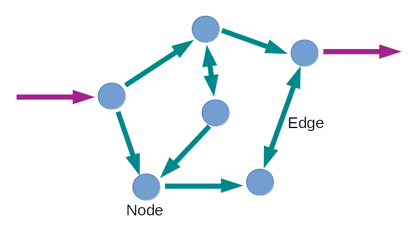

# Basic Python Lesson for Constraint-based Modelling (CMB)

## Metabolic Modelling Tutorial 

This is a basic introduction to biased constraint-based modelling (CMB) of metabolism using the [cobra](https://cobrapy.readthedocs.io/en/latest/) package. This package needs to be downloaded and installed prior to running any of the code below. 

### What is Modelling?

A model is a mathematical description of a system in a way that allows one to analyse how the different components interact with one another in order to make predictions about the overall behaviour of the system. 

To me modelling of biological systems is asking  the following: 
- What is the system that I want to study?
- What data do I have available that describes the system? 
- What assumptions can I make about that data?
- Given those assumptions, what can the data tell me? 

The main reason why models fail is because the assumptions made about the system are incorrect! 

### What is Metabolic Modelling? 

Metabolic models can start out as a network. The network represents the metabolites of the system as nodes (typically drawn as circles) and their interactions as edges (drawn as lines). There are input and out reactions through the model. 

Typically, constraint-based modelling (CMB) looks at how the flux through the network travels from the input reactions to the output reactions. For this, metabolism is assumed to be in steady-state (i.e. metabolite concentrations are not changing). 

The metabolic model can be constrained using experimental data. Where experimental data is available it can be used to set upper and lower bounds to the corresponding metabolic reactions. 

A metabolic goal of the system is then specified as an objective function. Solutions that maximize the objective function (i.e. make it have the maximum flux possible) are calculated to the metabolic model. 

Often multiple solutions are feasible within a metabolic network. For this reason we will analyse the upper and lower bound of each reaction. The true solution is expected to lie within these bounds. 

Only Flux Balance Analysis (FBA) and Flux Variability Analysis (FVA) will be discussed as CBM techniques. If you wish to consider other CBM techniques, such as flux sampling, please see the literature at the end. 

### Exercise 

We will build a very simple metabolic model. We will analyse the model features. 

Then we will then constrain the model with some example data and analyse the effect that the constraints have on the flux through the model. 

We will set an objective function and do a FBA and a FVA.

### Literature 

- [Cobrapy Documentation](https://cobrapy.readthedocs.io/en/latest/)
- [Review of FBA](https://www.ncbi.nlm.nih.gov/pmc/articles/PMC3108565/)
- [Review of different CBM techniques](https://www.ncbi.nlm.nih.gov/pmc/articles/PMC3536058/)
- [Review compaing kinetic & CBM techniques applied to study Arabidopsis](https://academic.oup.com/jxb/article-abstract/70/12/3043/5428176?redirectedFrom=fulltext)
- [A Flux Sampling Comparison](https://www.nature.com/articles/s41540-019-0109-0)
